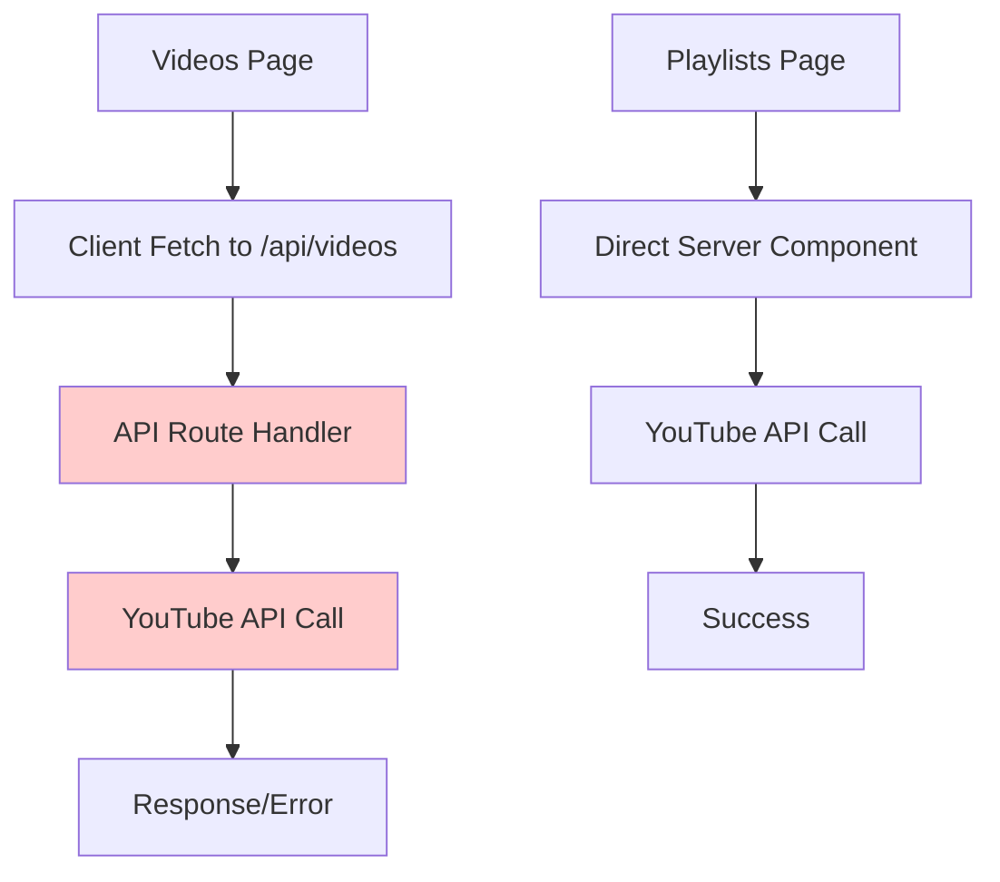
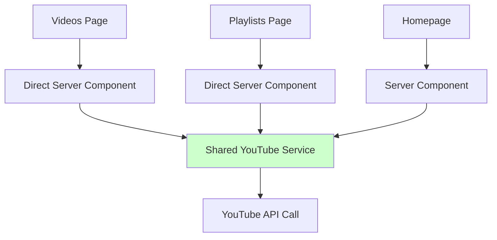

# Design Document

## Overview

The Videos page error occurs due to an architectural inconsistency between how the Videos and Playlists features access the YouTube API. The Videos page uses a client-server pattern with an API route (`/api/videos`), while the Playlists page directly accesses the YouTube API from server components. This creates different execution contexts and potential issues with environment variable access.

**Root Cause Analysis:**
- Videos page: Uses Next.js API route → Client-side fetch → Server-side YouTube API call
- Playlists page: Direct server-side YouTube API call from page component
- The API route may have different environment variable access or execution context issues

## Architecture

### Current Architecture Issues



### Proposed Architecture



## Components and Interfaces

### 1. YouTube Service Layer

Create a centralized service for all YouTube API interactions:

```typescript
// src/lib/youtube.ts
export interface YouTubeService {
  getChannelVideos(channelId: string, maxResults?: number): Promise<Video[]>
  getPlaylistVideos(playlistId: string, maxResults?: number): Promise<Video[]>
  validateApiKey(): Promise<boolean>
}
```

### 2. Error Handling Strategy

Implement consistent error handling across all YouTube API calls:

```typescript
export interface YouTubeError {
  type: 'API_KEY_MISSING' | 'API_KEY_INVALID' | 'QUOTA_EXCEEDED' | 'NETWORK_ERROR' | 'UNKNOWN'
  message: string
  details?: any
}
```

### 3. Logging Interface

Standardize logging for debugging:

```typescript
export interface YouTubeLogger {
  logRequest(endpoint: string, params: Record<string, any>): void
  logResponse(success: boolean, data?: any, error?: any): void
  logError(error: YouTubeError): void
}
```

## Data Models

### Enhanced Video Interface

```typescript
export interface Video {
  id: string
  title: string
  description: string
  thumbnailUrl: string
  youtubeVideoId: string
  thumbnailAiHint?: string
  publishedAt?: string
  channelTitle?: string
}
```

### API Response Wrapper

```typescript
export interface YouTubeApiResult<T> {
  success: boolean
  data?: T
  error?: YouTubeError
}
```

## Error Handling

### 1. Environment Variable Validation

- Validate YouTube API key at application startup
- Provide clear error messages for missing/invalid keys
- Log validation results for debugging

### 2. API Error Classification

- **API_KEY_MISSING**: No API key configured
- **API_KEY_INVALID**: Key exists but is invalid/restricted
- **QUOTA_EXCEEDED**: Daily quota limit reached
- **NETWORK_ERROR**: Connection/timeout issues
- **UNKNOWN**: Unexpected errors

### 3. Graceful Degradation

- Show appropriate error messages to users
- Provide fallback content where possible
- Log detailed errors for developers

### 4. Consistent Error UI

- Standardize error display components
- Provide actionable error messages
- Include troubleshooting hints for developers

## Testing Strategy

### 1. Unit Tests

- Test YouTube service methods with mocked API responses
- Test error handling for different failure scenarios
- Test data transformation and validation

### 2. Integration Tests

- Test actual YouTube API calls with test API key
- Verify error handling with invalid API keys
- Test quota limit scenarios

### 3. Component Tests

- Test Videos page with successful API responses
- Test Videos page with various error states
- Test Playlists page consistency

### 4. End-to-End Tests

- Verify Videos page loads correctly
- Verify Playlists pages load correctly
- Test error scenarios from user perspective

## Implementation Strategy

### Phase 1: Create Shared YouTube Service
- Extract YouTube API logic into shared service
- Implement consistent error handling
- Add comprehensive logging

### Phase 2: Refactor Videos Page
- Remove API route dependency
- Use direct server component approach like Playlists
- Implement new error handling

### Phase 3: Standardize Playlists
- Update Playlists to use shared service
- Ensure consistent error handling
- Add proper logging

### Phase 4: Update Homepage
- Migrate homepage YouTube calls to shared service
- Ensure consistency across all features

### Phase 5: Testing and Validation
- Add comprehensive tests
- Validate error scenarios
- Performance testing

## Migration Considerations

- **Backward Compatibility**: Remove API route after migration
- **Environment Variables**: Ensure consistent access patterns
- **Caching**: Maintain existing caching behavior
- **Performance**: Direct server calls should be faster than API routes
- **Error Messages**: Improve user-facing error messages